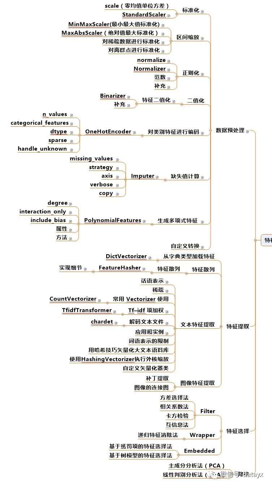

# learning-dl
## Goal
This repo is for my study on DL/ML. I'd like to record the long walking on this road.

This field is a little bit too big for me right now. I would like to cut this issue into three terms:

- Short Term: Python programming skill, Virturalization
- Middle Term: ML/DL models , classic algorithm implementation
- Long Term: Mathematics and Papers

## Roadmap
I borrow one picture from [Virgilio](https://github.com/virgili0/Virgilio) as:

## Courses and projects
- The favorite __Course__ on this subjuct: [Deeping Learning by Andew on Coursera](https://www.coursera.org/specializations/deep-learning)
- The favorite __GitHub__ : [Virgilio](https://github.com/virgili0/Virgilio)
- The favorite __CN GitHub__:[ApacheCN](https://github.com/apachecn)
- Another useful __GitHub__:[从入门到进阶，所用到机器学习资料，包括书、视频、源码](https://github.com/linxid/Machine_Learning_Study_Path)
- Mathematics: [The Matrix Calculus You Need For Deep Learning](https://explained.ai/matrix-calculus/index.html#sec4.5)
- [CNN Papers](https://github.com/robertsdionne/neural-network-papers)
- [numpy-ml](https://github.com/ddbourgin/numpy-ml)

There are several parts in this repo:
## Andrew-NG-DL-Course 
For: Asignments of Andrew NG's DL course

## Learning-Python
For: my learning on python

## Learning-Virgilio

## Try-Kaggle
- Kaggle [Websit](https://www.kaggle.com/) [GitHub](https://github.com/Kaggle)
- 天池/京东/CCF/challenger.ai

## Misc
Tools and other useful stuffs

## Papers
Paper is difficult.
Paper is important.
I borrow a roadmap for paper reading from [GitHub](https://github.com/hoya012/deep_learning_object_detection)

[Deep-Learning-Papers-Reading-Roadmap](https://github.com/floodsung/Deep-Learning-Papers-Reading-Roadmap)

[Papers with Code(Sorted by stars)](https://github.com/zziz/pwc)

[100 Must-Read NLP Papers](https://github.com/mhagiwara/100-nlp-papers)

## ML Algorithms
One algorithm one day
- ML Classic Algorithms
    - K-Means
    - KNN
    - Decision Tree
    - Random Forest
- DL
    - CNN
    - RNN

- Boost
    - [XGBoost](https://blog.csdn.net/huacha__/article/details/81029680#%E4%B8%89%E3%80%81MacOS%E5%AE%89%E8%A3%85XGBoost)
        - [A brief PDF](misc/pdfs/xgboost.pdf)
        - [Offical Doc](https://xgboost.readthedocs.io/en/latest/index.html)
    - lightgbm
    - CatBoost
    - [Battle of the Boosting Algorithms](https://lavanya.ai/2019/06/27/battle-of-the-boosting-algorithms/)

##Browse state-of-the-art 

- [websit](<https://paperswithcode.com/sota>)
- [CV](<https://paperswithcode.com/area/computer-vision>)
- [NLP](<https://paperswithcode.com/area/natural-language-processing>)

## __Maths__
I love maths.

## [__Feature__ Engineering](https://www.cnblogs.com/jasonfreak/p/5448385.html)

## Blogs
- Summary or Cheatsheet for DL/ML
  - [CS 230 ― Deep Learning](https://stanford.edu/~shervine/teaching/cs-230/)

## FQA

[DeepLearning-500-questions](https://github.com/scutan90/DeepLearning-500-questions)

## My Walking on learning DL
DATE | WHAT
---|---
May 01 2019 | Start Andew NG's deeplearning.ai
May 02 2019 | Download Feifei Lee's Stanford CNN course
May 03 2019 | Environment on Ubuntu14.04
May 12 2019 | Knowing about __Virgilio__ 
May 20 2019 | Finish Andew NG's deeplearning.ai
May 21 2019 | Environment on MacBook
May 25 2019 | Learning on NumPy/Matplotlib
May 26 2019 | Learning on Pandas
May 27 2019 | Read data-science-cheatsheet.pdf
May 28 2019 | Focus on Virtulization
May 29 2019 | Try MLDemos
May 30 2019 | Python interview questions 
Jun 01 2019 | Try [PyTorch](https://pytorch.org/)
Jun 02 2019 | Try [TensorFlow](https://www.tensorflow.org/)
Jun 03 2019 | Hands on [Scikit-Learn](https://scikit-learn.org/)
Jun 04 2019 | Hands on [TensorFlow](https://www.tensorflow.org/) 
Jun 05 2019 | Browse Virgilio/AppacheCN
Jun 06 2019 | Read WaterMelon-Book
Jun 07 2019 | Study classic sorting algorithm and do it in Python
Jun 08 2019 | Study Data-Structure in Python
Jun 10 2019 | Study Kaggle Cases: Titanic 
Jun 12 2019 | Study Kaggle Cases: Extensive US Youtube 
Jun 13 2019 | Start a project on algorithm study
Jun 13 2019 | Start to finish a tutorial from [Kaggle Data Visualization](https://www.kaggle.com/learn/data-visualization) within 1 week
Jun ~19 2019 | Play on Kaggle
Jun 19 2019 | Practice on data preprocessing
Jun 20 2019 | Learn [__Transfer Learning__](https://github.com/jindongwang/transferlearning)
Jun 28 2019 | Learn [__XGBoost__](https://xgboost.readthedocs.io/en/latest/index.html)
Jul 04 2019 | Learn [__Feature Engineering__](https://arxiv.org/abs/1811.12808)
Jul ~15 2019 | Learn PR
Jul ~30 2019 | 图解机器学习
Aug ~20 2019 | 百面机器学习：算法工程师带你去.pdf
Aug ~31 2019 | 图解深度学习
