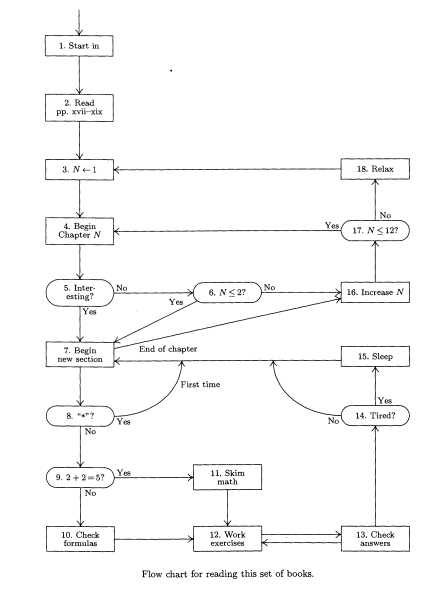

### My Flow

```flow
st=>start: 1. Start in
ed=>end: end
prepare=>operation: 2. Read 
       		pp:xvii-xix
setN=>operation: 3. N=1
beginN=>operation: 4. Begin Chapter N
checkInteresting=>condition: 5. Interesting?
checkNLe2=>condition: 6. N <= 2
beginNewSection=>operation: 7. Begin
				new section
starQuestion=>condition: 8. "*"?
2and2=>condition: 9. 2+2=5?
checkfomulas=>operation: 10: Check
				formulas
skimMath=>operation: 11. Skim 
						math
workExercises=>operation: 12. Work
							exercises
checkAnswer=>operation: 13. Check 
						answers
tiredOrNot=>condition: 14. Tired
sleep=>operation: 15. Sleep				
increaseN=>operation: 16. Increase N	
NLe12OrNot=>condition: 17. N<=12
relax=>operation: 18: Relax
st->prepare->setN->beginN->checkInteresting
checkInteresting(yes)->beginNewSection->starQuestion
checkInteresting(no)->checkNLe2
checkNLe2(yes)->beginNewSection
checkNLe2(no)->increaseN->NLe12OrNot
NLe12OrNot(no)->relax->setN
NLe12OrNot(yes)->beginN
starQuestion(yes)->beginNewSection
starQuestion(no)->2and2
2and2(no)->checkfomulas->workExercises
2and2(yes)->skimMath->workExercises->checkAnswer->tiredOrNot
tiredOrNot(yes)->sleep
tiredOrNot(no)->beginNewSection
```

### The more beautiful one


