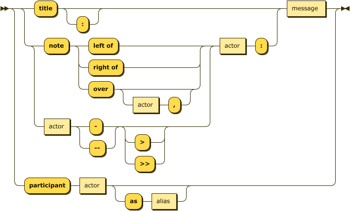

# Features of Typora

This is an example for how to write with Typora

------

### Table of Contents

[TOC]

### Basic

- Heading
- Emphasis
- Hype-link
- Code Fences
- List
  - ordered List
  - unordered List
- Task List
  - Completed 
  - To Do
- Table
- Table of Content
- Image


### Maths

$$
- \frac{\hbar^2}{2\mu}\frac{\partial^2\Psi(x,t) }{\partial x^2} 
+ U(x,t)\Psi(x,t) = i\hbar \frac{\partial\Psi(x,t)}{\partial t}
$$


### Sequence

#### Grammar



#### Title and Lines

``` sequence
Title: Here is a title
A->B: Normal line
B-->C: Dashed line
C->>D: Open arrow
D-->>A: Dashed open arrow
```

#### comment

``` sequence
# Example of a comment.
Note left of A: Note to the\n left of A
Note right of A: Note to the\n right of A
Note over A: Note over A
Note over A,B: Note over both A and B
```

``` sequence
participant C
participant B
participant A
Note right of A: By listing the participants\n you can change their order
```

#### participant

``` sequence
participant Long Name Here as A
participant Anoter Lonename as B
A --> B: Hello
B --> A: Hi
```


#### An example

```sequence
Title: Title Here 
#optional
participant Andrew 
participant China

Note over Andrew,China: Notes Over Two
Andrew->China: Says Hello 
Note  over Andrew: Notes Over One
Note right of China: China thinks\nabout it 
China-->Andrew: How are you? 
Andrew-->>China: I am good thanks!
Note left of Andrew: Aha....


```

### Flow

#### Items

	- start 
	- end
	- operation
	- subroutine
	- inputoutput
	- parallel


```flow
st=>start: Start:>http://www.google.com[blank]
e=>end:>http://www.google.com
op1=>operation: My Operation
sub1=>subroutine: My Subroutine
cond=>condition: Yes
or No?:>http://www.google.com
io=>inputoutput: catch something...
para=>parallel: parallel tasks

st->op1->cond
cond(yes)->io->e
cond(no)->para
para(path1, bottom)->sub1(right)->op1
para(path2, top)->op1
```

``` flow
st=>start: Start|past:>http://www.google.com[blank]
e=>end: End|future:>http://www.google.com
op1=>operation: My Operation|past
op2=>operation: Stuff|current
sub1=>subroutine: My Subroutine|invalid
cond=>condition: Yes
or No?|approved:>http://www.google.com
c2=>condition: Good idea|rejected
io=>inputoutput: catch something...|future

st->op1(right)->cond
cond(yes, right)->c2
cond(no)->sub1(left)->op1
c2(yes)->io->e
c2(no)->op2->e
```

``` flow
st=>start: Improve your
l10n process!
e=>end: Continue to have fun!:>https://youtu.be/YQryHo1iHb8[blank]
op1=>operation: Go to locize.com:>https://locize.com[blank]
sub1=>subroutine: Read the awesomeness
cond(align-next=no)=>condition: Interested to
getting started?
io=>inputoutput: Register:>https://www.locize.io/register[blank]
sub2=>subroutine: Read about improving
your localization workflow
or another source:>https://medium.com/@adrai/8-signs-you-should-improve-your-localization-process-3dc075d53998[blank]
op2=>operation: Login:>https://www.locize.io/login[blank]
cond2=>condition: valid password?
cond3=>condition: reset password?
op3=>operation: send email
sub3=>subroutine: Create a demo project
sub4=>subroutine: Start your real project
io2=>inputoutput: Subscribe

st->op1->sub1->cond
cond(yes)->io->op2->cond2
cond2(no)->cond3
cond3(no,bottom)->op2
cond3(yes)->op3
op3(right)->op2
cond2(yes)->sub3
sub3->sub4->io2->e
cond(no)->sub2(right)->op1

st@>op1({"stroke":"Red"})@>sub1({"stroke":"Red"})@>cond({"stroke":"Red"})@>io({"stroke":"Red"})@>op2({"stroke":"Red"})@>cond2({"stroke":"Red"})@>sub3({"stroke":"Red"})@>sub4({"stroke":"Red"})@>io2({"stroke":"Red"})@>e({"stroke":"Red","stroke-width":6,"arrow-end":"classic-wide-long"})
```

