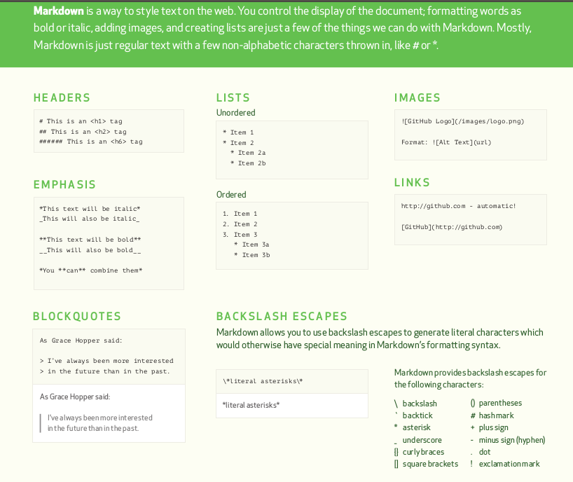
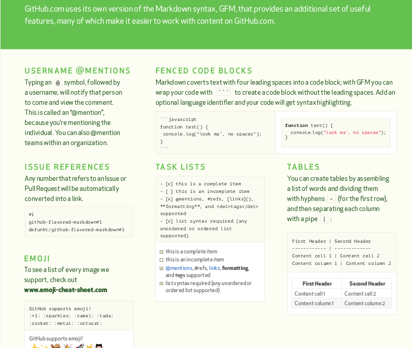
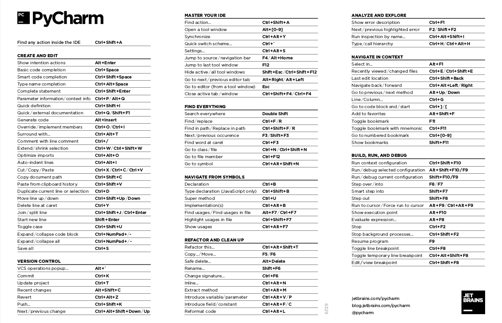

Tools that for developing and design
---

- MarkDown
	- Ubuntu: Remarkable
	- [MarkDown on Mac](https://www.jianshu.com/p/7901d233df54)
	- Android Phone（CN ）坚果云
    

- Jupyther
    - Magic Key: P

- PyCharm
    - Magic Key: Ctrl+Shift+A

- LaTex
    - [pdf](pdfs/LaTeX_cheat_sheet.pdf)
    (As the grammar is a bit too complicated, I'll study it later.)
