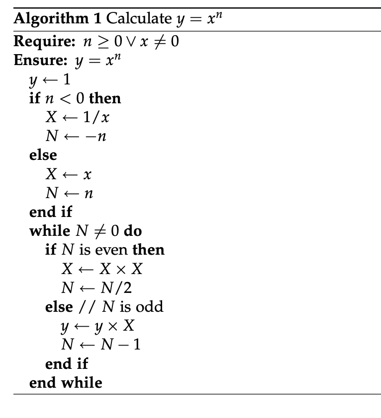
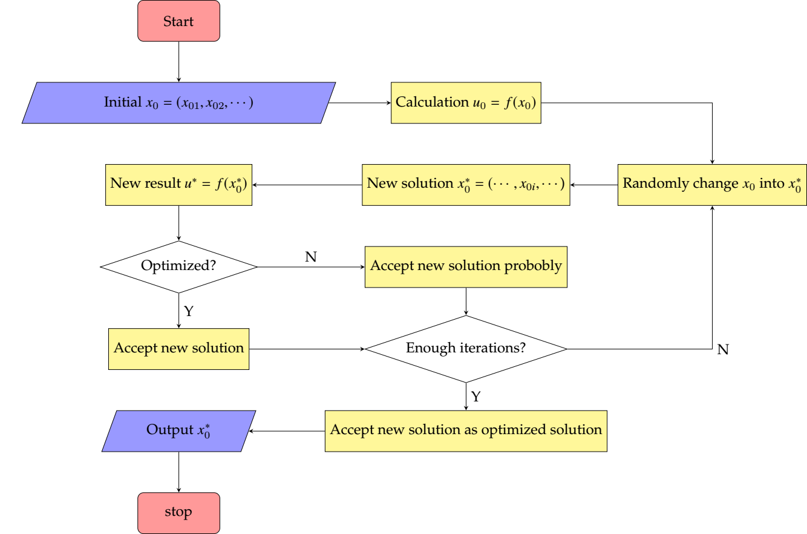

[TOC]


# Latex Algorithm

## Notes after reading  *The algorithms bundle*

### Installation

```bash
#download package
sudo tlmgr update --self
sudo tlmgr install algorithm

#generate .sty and other files to use for TexLive
cd /usr/local/texlive/2019/texmf-dist/source/latex/algorithms
sudo latex algorithms.ins
sudo latex algorithms.dtx

# then go to check
αζ@Δ algorithms$ pwd
/usr/local/texlive/2019/texmf-dist/tex/latex/algorithms
αζ@Δ algorithms$ ls
algorithm.sty   algorithmic.sty
```

**Another Way** is to download the package from [official website](https://ctan.org/pkg)


 ### Algorithmic Example

``` latex
\begin{algorithmic}
\REQUIRE $n \geq 0$
\ENSURE $y = x^n$
\STATE $y \leftarrow 1$
\STATE $X \leftarrow x$
\STATE $N \leftarrow n$ \WHILE{$N \neq 0$}
\IF{$N$ is even}
\STATE $X \leftarrow X \times X$ \STATE $N \leftarrow N / 2$ \ELSE[$N$ is odd]
\STATE $y \leftarrow y \times X$ \STATE $N \leftarrow N - 1$ \ENDIF
\ENDWHILE
\end{algorithmic}
```

```pseudocode
Require: n ≥ 0 
Ensure: y = xn
	y←1
	X←x
	N←n
	while N!= 0 do
		if N is even then
			X←X×X
			N ← N/2
		else {N is odd} 
			y←y×X 
			N←N−1
		end if 
	end while
```


### Algorithm Example

``` tex
\begin{algorithm} \caption{Calculate $y = x^n$} \label{alg1}
\begin{algorithmic}
\REQUIRE $n \geq 0 \vee x \neq 0$ \ENSURE $y = x^n$
\STATE $y \leftarrow 1$
\IF{$n < 0$}
\STATE $X \leftarrow 1 / x$ \STATE $N \leftarrow -n$
\ELSE
\STATE $X \leftarrow x$
\STATE $N \leftarrow n$
\ENDIF
\WHILE{$N \neq 0$}
\IF{$N$ is even}
\STATE $X \leftarrow X \times X$ \STATE $N \leftarrow N / 2$ \ELSE[$N$ is odd]
\STATE $y \leftarrow y \times X$ \STATE $N \leftarrow N - 1$ \ENDIF
\ENDWHILE
\end{algorithmic}
\end{algorithm}
```

```pseudocode

Algorithm 1 Calculate y = xn 
Require: n≥0∨x̸=0 Ensure: y = xn
y←1
if n<0then
X ← 1/x
N ← −n else
X←x
N←n end if
while N ̸= 0 do
if N is even then
X←X×X
N ← N/2 else {N is odd}
y←y×X
N←N−1 end if
end while
   
```



## Other Network source 

- [Wiki](https://en.wikibooks.org/wiki/LaTeX/Algorithms) 


# TilK


## Two Example

```tex
\documentclass[a4paper,UTF8]{article}  
\usepackage{xcolor}  
\usepackage{tikz}  
\usetikzlibrary{arrows,shapes,chains}  
\begin{document}  		
	\centering  
	\begin{figure}  
		\scriptsize  
		\tikzstyle{format}=[rectangle,draw,thin,fill=white]  
		%定义语句块的颜色,形状和边
		\tikzstyle{test}=[diamond,aspect=2,draw,thin]  
		%定义条件块的形状,颜色
		\tikzstyle{point}=[coordinate,on grid,]  
		%像素点,用于连接转移线
		\begin{tikzpicture}%[node distance=10mm,auto,>=latex',thin,start chain=going below,every join/.style={norm},] 
		%start chain=going below指明了流程图的默认方向，node distance=8mm则指明了默认的node距离。这些可以在定义node的时候更改，比如说 
		%\node[point,right of=n3,node distance=10mm] (p0){};  
		%这里声明了node p0，它在node n3 的右边，距离是10mm。
		\node[format] (start){Start};
		\node[format,below of=start,node distance=7mm] (define){Some defines};
		\node[format,below of=define,node distance=7mm] (PCFinit){PCF8563 Initialize};
		\node[format,below of=PCFinit,node distance=7mm] (DS18init){DS18 Initialize};
		\node[format,below of=DS18init,node distance=7mm] (LCDinit){LCD Initialize};
		\node[format,below of=LCDinit,node distance=7mm] (processtime){Processtime};
		\node[format,below of=processtime,node distance=7mm] (keyinit){Key Initialize};
		\node[test,below of=keyinit,node distance=15mm](setkeycheck){Check Set Key};
		\node[point,left of=setkeycheck,node distance=18mm](point3){};
		\node[format,below of=setkeycheck,node distance=15mm](readtime){Read Time};
		\node[point,right of=readtime,node distance=15mm](point4){};
		\node[format,below of=readtime](processtime1){Processtime};
		\node[format,below of=processtime1](gettemp){Get Temperature};
		\node[format,below of=gettemp](display){Display All Data};
		\node[format,right of=setkeycheck,node distance=40mm](setsetflag){Set SetFlag=1};
		\node[format,below of=setsetflag](setinit){Set Mode Initialize};
		\node[format,below of=setinit](checksetting){Checksetting()};
		\node[test,below of=checksetting,node distance=15mm](savecheck){Check Save Key};
		\node[format,below of=savecheck,node distance=15mm](clearsetflag){Clear SetFlag=0};
		\node[format,below of=clearsetflag](settime){Set Time};
		\node[point,below of=display,node distance=7mm](point1){};
		\node[point,below of=settime,node distance=7mm](point2){};
		%\node[format] (n0) at(4,4){A}; 直接指定位置 
		%定义完node之后进行连线,
		%\draw[->] (n0.south) -- (n1); 带箭头实线
		%\draw[-] (n0.south) -- (n1); 不带箭头实线
		%\draw[<->] (n0.south) -- (n1.north);   双箭头
		%\draw[<-,dashed] (n1.south) -- (n2.north); 带箭头虚线 
		%\draw[<-] (n0.south) to node{Yes} (n1.north);  带字,字在箭头方向右边
		%\draw[->] (n1.north) to node{Yes} (n0.south);  带字,字在箭头方向左边
		%\draw[->] (n1.north) to[out=60,in=300] node{Yes} (n0.south);  曲线
		%\draw[->,draw=red](n2)--(n1);  带颜色的线
		\draw[->] (start)--(define);
		\draw[->] (define)--(PCFinit);
		\draw[->](PCFinit)--(DS18init);
		\draw[->](DS18init)--(LCDinit);
		\draw[->](LCDinit)--(processtime);
		\draw[->](processtime)--(keyinit);
		\draw[->](keyinit)--(setkeycheck);
		\draw[->](setkeycheck)--node[above]{Yes}(setsetflag);
		\draw[->](setkeycheck) --node[left]{No} (readtime);
		\draw[->](readtime)--(processtime1);
		\draw[->](processtime1)--(gettemp);
		\draw[->](gettemp)--(display);
		\draw[-](display)--(point1);
		\draw[-](point1)-|(point3);
		\draw[->](point3)--(setkeycheck.west);
		\draw[->](setsetflag)--(setinit);
		\draw[->](setinit)--(checksetting);
		\draw[->](checksetting)--(savecheck);
		\draw[->](savecheck)--node[left]{Yes}(clearsetflag);
		\draw[->](savecheck.west)|-node[left]{No}(checksetting);
		\draw[->](clearsetflag)--(settime);
		\draw[-](settime)--(point2);
		\draw[-](point2)-|(point4);
		\draw[->](point4)--(readtime.east);
		\end{tikzpicture}  
	\end{figure}  
\end{document}  
```


```tex
\documentclass{standalone}
\usepackage{newtxmath}
\usepackage{palatino}
\usepackage{amsmath}
\usepackage{tikz}
\usetikzlibrary{shapes.geometric, arrows}
\begin{document}
\thispagestyle{empty}
% 流程图定义基本形状
\tikzstyle{startstop} = [rectangle, rounded corners, minimum width = 2cm, minimum height=1cm,text centered, draw = black, fill = red!40]
\tikzstyle{io} = [trapezium, trapezium left angle=70, trapezium right angle=110, minimum width=2cm, minimum height=1cm, text centered, draw=black, fill = blue!40]
\tikzstyle{process} = [rectangle, minimum width=3cm, minimum height=1cm, text centered, draw=black, fill = yellow!50]
\tikzstyle{decision} = [diamond, aspect = 3, text centered, draw=black, fill = green!30]
% 箭头形式
\tikzstyle{arrow} = [->,>=stealth]
\begin{tikzpicture}[node distance=2cm]
%定义流程图具体形状
\node (start) [startstop]
{Start};
\node (in1) [io, below of = start]
{Initial $x_0=(x_{01},x_{02},\cdots)$};
\node (pro1) [process, right of = in1, xshift = 5cm]
{Calculation $u_0=f(x_0)$};
\node (pro4) [process, below of = in1]
{New result $u^*=f(x_0^*)$};
\node (pro3) [process, below of=pro1]
{New solution $x_0^*=(\cdots,x_{0i},\cdots$)};
\node (pro2) [process, right of=pro3, xshift = 4cm]
{Randomly change $x_0$ into $x_0^*$};
\node (dec1) [decision, below of=pro4]
{Optimized?};
\node (pro5) [process, below of=pro3]
{Accept new solution probobly};
\node (pro6) [process, below of=dec1]
{Accept new solution};
\node (dec2) [decision, below of=pro5]
{Enough iterations?};
\node (pro7) [process, below of=dec2]
{Accept new solution as optimized solution};
\node (out1) [io, below of=pro6]
{Output $x_0^*$};
\node (stop) [startstop, below of=out1]
{stop};
%连接具体形状
\draw [arrow] (start) -- (in1);
\draw [arrow] (in1) -- (pro1);
\draw [arrow] (pro1) -| (pro2);
\draw [arrow] (pro2) -- (pro3);
\draw [arrow] (pro3) -- (pro4);
\draw [arrow] (pro4) -- (dec1);
\draw [arrow] (dec1) --node [above] {N} (pro5);
\draw [arrow] (dec1) --node [right] {Y} (pro6);
\draw [arrow] (pro6) -- (dec2);
\draw [arrow] (pro5) -- (dec2);
\draw [arrow] (dec2) -|node [right] {N} (pro2);
\draw [arrow] (dec2) --node [right] {Y} (pro7);
\draw [arrow] (pro7) -- (out1);
\draw [arrow] (out1) -- (stop);
\end{tikzpicture}
\end{document}
```


