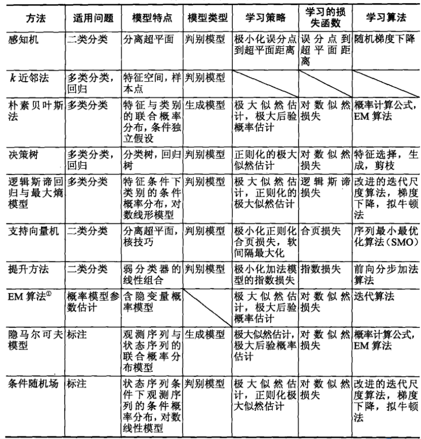
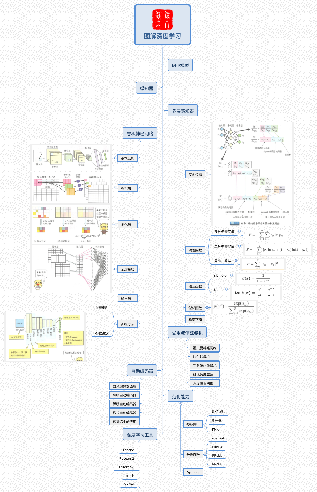
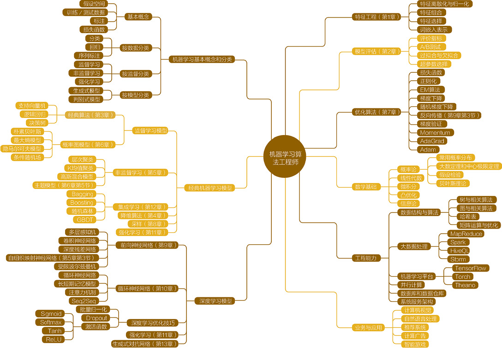

Reading Books
------------
“读数破万卷，下笔如有神”
“我生也有涯，而知也无涯，以有涯逐无涯殆矣！”
“书不尽言，言不尽意”
“想象力比知识更重要”
"纸上得来终觉浅，绝知此事要躬行"

# 图解机器学习.pdf

# 周志华-机器学习_.pdf
- [公式的推导](https://github.com/datawhalechina/pumpkin-book)
- [课后习题](https://zhuanlan.zhihu.com/c_1013850291887845376)

# Different Perspectives
- ML - A Bayesian and Optimization Perspective.Elsevier.2015
- ML - A Constraint-Based Approach.2018
- ML - A.Probabilistic.Perspective.MIT.2012
- ML - An Algorithmic Perspective 2nd Ed

# TensorFlow
- Learning TensorFlow - 2017
- TensorFlow for Deep Learning - 2018
- Machine Learning with TensorFlow - 2017


# Hands-On Machine Learning with Scikit-Learn and TensorFlow
```
Hands-On Machine Learning with Scikit-Learn and TensorFlow
by Aurélien Géron
Copyright © 2017 Aurélien Géron. All rights reserved.
Printed in the United States of America.
Published by O’Reilly Media, Inc., 1005 Gravenstein Highway North, Sebastopol, CA 95472.
```

# Deep Learning with Python.pdf


# TODO
- ML
  - Building Machine Learning Systems with Python - Richert, Coelho.pdf
  - Machine Learning  A Bayesian and Optimization Perspective.pdf
  - Machine Learning - An Algorithmic Perspective 2nd Edition.pdf
  - Machine.Learning.A.Probabilistic.Perspective,.Kevin.P..Murphy,.MIT.Press,.2012.pdf
  - Machine Learning - Tom Mitchell.pdf
  - Machine Learning - Tom Mitchell(中文版).pdf
  - OReilly.Hands-On.Machine.Learning.with.Scikit-Learn.and.TensorFlow.2017.3.pdf
  - Pattern Recognition and Machine Learning.pdf
  - sanet.cd_Machine Learning A Constraint-Based Approach.pdf
- DL
  - deep+learning book_cn_v0.5-beta.pdf
  - deeplearningbook.pdf
  - Deep Learning with Keras_wrapper.pdf
  - Deep Learning with Python.pdf
  - Deep Learning（深度学习）学习笔记整理.pdf
  - 图解深度学习
- Interview
  - 百面机器学习：算法工程师带你去.pdf
  - 
- DS 
  - Python for Data Analysis.pdf
  - Python Data Science Handbook [github](https://github.com/jakevdp/PythonDataScienceHandbook)
  - Data Science Algorithms in a Week.pdf
  - [github books](https://github.com/SayantanMitra87/Data-Science-Books-1)


## Comparation
I get one picture from Internet [《统计学习方法》(李航)读书笔记(完结)](https://www.cnblogs.com/limitlessun/p/8611103.html) as



## NOTES
[PHD.David Abel on ICML2019](https://david-abel.github.io/notes/iclr_2019.pdf)



## Others


