<h1 align="center">Introduction</h1>In this kernel, i have tried to introduce various machine learning models and their implementation. The sole perpose of this kernel is to correctly identify the presence of any heart disease based on the given input. We proceed by giving a general introduction towards the disease followed by dataset's attributes and what they resemble. As we descend down the kernel , i have used various Machine Learning and Deep Learning approach. 


Note:- This Kernel is subject to get updated as soon as i find something which can be revelant to the context.

<h1>About Heart Disease</h1>Heart disease is a general term that means that the heart is not working normally. Babies can be born with heart disease. This is called congenital heart disease. If people get heart disease later, it is called acquired heart disease. Most heart disease is acquired.
The three most common types of acquired heart disease are:

<li><b>Coronary Artery Disease (acronym CAD)</b></li> 
<li><b>Congestive Heart Failure (CHF)</b></li>
<li><b>Bad Heart Rhythms</b></li>

<h3>DEATHS</h3>
<p>Heart disease is the biggest killer of both men and women in the United States, England, Wales, and Canada. For example, heart disease causes 4 out of every 10 deaths in the United States.This is more than all kinds of cancer put together. Also, one person dies of heart disease about every minute in the United States alone.</p>

<b> Loading common dependencies </b>


```python
# This Python 3 environment comes with many helpful analytics libraries installed
# It is defined by the kaggle/python docker image: https://github.com/kaggle/docker-python
# For example, here's several helpful packages to load in 

import numpy as np # linear algebra
import pandas as pd # data processing, CSV file I/O (e.g. pd.read_csv)

# Input data files are available in the "../input/" directory.
# For example, running this (by clicking run or pressing Shift+Enter) will list the files in the input directory

import os
print(os.listdir("./data"))
import warnings
warnings.filterwarnings("ignore")
import numpy as np # linear algebra
import pandas as pd # data processing, CSV file I/O (e.g. pd.read_csv)
import tensorflow as tf
import matplotlib.pyplot as plt
import seaborn as sns
from sklearn.manifold import TSNE
from sklearn.decomposition import PCA, TruncatedSVD
import matplotlib.patches as mpatches
import time

# Classifier Libraries
from sklearn.linear_model import LogisticRegression
from sklearn.svm import SVC
from sklearn.neighbors import KNeighborsClassifier
from sklearn.tree import DecisionTreeClassifier
from sklearn.ensemble import RandomForestClassifier
import collections

# Deep Learning Libraries
from keras.models import Sequential
from keras.layers import Dense,Dropout

# Misc. Libraries
from imblearn.datasets import fetch_datasets
from sklearn.model_selection import train_test_split
from sklearn.pipeline import make_pipeline
from imblearn.pipeline import make_pipeline as imbalanced_make_pipeline
from imblearn.over_sampling import SMOTE
from imblearn.under_sampling import NearMiss
from imblearn.metrics import classification_report_imbalanced
from collections import Counter
from sklearn.model_selection import KFold, StratifiedKFold
from sklearn.metrics import confusion_matrix,f1_score,precision_score,recall_score,accuracy_score
import warnings
warnings.filterwarnings("ignore")

import seaborn as sns
import matplotlib.pyplot as plt
```

    ['heart.csv', 'heart-disease-uci.zip']


<b>Going through the dataset, first impression </b>

Loading the dataset


```python
data=pd.read_csv("./data/heart.csv")
```


```python
print('Heart Disease', round(data['target'].value_counts()[1]/len(data) * 100,2), '% of the target ')
print('No heart Disease', round(data['target'].value_counts()[0]/len(data) * 100,2), '% of the target')
```

    Heart Disease 54.46 % of the target 
    No heart Disease 45.54 % of the target


We see that the Heart disease occured 54.3 % of the times in the dataset, whilst the 45.7% were the no heart disease. So, we need to balance the dataset otherwise it might get overfit. This will help the model to find pattern in the dataset which contributes to the heart disease and which doesn't.


```python
sns.countplot('target', data=data, palette="winter")
plt.title('Class Distributions \n 0: No Disease || 1: Disease', fontsize=14)

```


    Text(0.5, 1.0, 'Class Distributions \n 0: No Disease || 1: Disease')


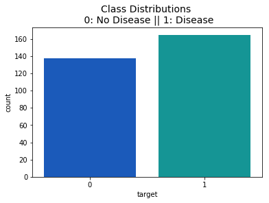


```python
data.head()
```


<div>
<style scoped>
    .dataframe tbody tr th:only-of-type {
        vertical-align: middle;
    }
    .dataframe tbody tr th {
        vertical-align: top;
    }
    .dataframe thead th {
        text-align: right;
    }
    </style>
<table border="1" class="dataframe">
  <thead>
    <tr style="text-align: right;">
      <th></th>
      <th>age</th>
      <th>sex</th>
      <th>cp</th>
      <th>trestbps</th>
      <th>chol</th>
      <th>fbs</th>
      <th>restecg</th>
      <th>thalach</th>
      <th>exang</th>
      <th>oldpeak</th>
      <th>slope</th>
      <th>ca</th>
      <th>thal</th>
      <th>target</th>
    </tr>
  </thead>
  <tbody>
    <tr>
      <th>0</th>
      <td>63</td>
      <td>1</td>
      <td>3</td>
      <td>145</td>
      <td>233</td>
      <td>1</td>
      <td>0</td>
      <td>150</td>
      <td>0</td>
      <td>2.3</td>
      <td>0</td>
      <td>0</td>
      <td>1</td>
      <td>1</td>
    </tr>
    <tr>
      <th>1</th>
      <td>37</td>
      <td>1</td>
      <td>2</td>
      <td>130</td>
      <td>250</td>
      <td>0</td>
      <td>1</td>
      <td>187</td>
      <td>0</td>
      <td>3.5</td>
      <td>0</td>
      <td>0</td>
      <td>2</td>
      <td>1</td>
    </tr>
    <tr>
      <th>2</th>
      <td>41</td>
      <td>0</td>
      <td>1</td>
      <td>130</td>
      <td>204</td>
      <td>0</td>
      <td>0</td>
      <td>172</td>
      <td>0</td>
      <td>1.4</td>
      <td>2</td>
      <td>0</td>
      <td>2</td>
      <td>1</td>
    </tr>
    <tr>
      <th>3</th>
      <td>56</td>
      <td>1</td>
      <td>1</td>
      <td>120</td>
      <td>236</td>
      <td>0</td>
      <td>1</td>
      <td>178</td>
      <td>0</td>
      <td>0.8</td>
      <td>2</td>
      <td>0</td>
      <td>2</td>
      <td>1</td>
    </tr>
    <tr>
      <th>4</th>
      <td>57</td>
      <td>0</td>
      <td>0</td>
      <td>120</td>
      <td>354</td>
      <td>0</td>
      <td>1</td>
      <td>163</td>
      <td>1</td>
      <td>0.6</td>
      <td>2</td>
      <td>0</td>
      <td>2</td>
      <td>1</td>
    </tr>
  </tbody>
</table>
</div>


<h1> Attributes and what does they resemble </h1>
* **age**: Age of patient
* **sex**:Sex, 1 for male
* **cp**:chest pain
* **trestbps**:resting blood pressure,more than 120 over 80 and less than 140 over 90 (120/80-140/90): You have a normal blood pressure reading but it is a little higher than it should be, and you should try to lower it. Make healthy changes to your lifestyle.
* **chol**:serum cholesterol,shows the amount of triglycerides present. Triglycerides are another lipid that can be measured in the blood. 
* **fbs**:fasting blood sugar larger 120mg/dl (1 true),less than 100 mg/dL (5.6 mmol/L) is normal,100 to 125 mg/dL (5.6 to 6.9 mmol/L) is considered prediabetes
* **rest**:ecg resting electrode.
* **thalach**:maximum heart rate achieved, maximum heart rate is 220 minus your age.
* **exang**:exercise induced angina (1 yes),Angina is a type of chest pain caused by reduced blood flow to the heart.Angina is a symptom of coronary artery disease.
* **oldpeak**: ST depression induced by exercise relative to rest
* **slope**:slope of peak exercise ST
* **ca**:number of major vessel
* **thal**:no explanation provided, but probably thalassemia (3 normal; 6 fixed defect; 7 reversable defect)
* **result**:(1 anomality)	num	diagnosis of heart disease (angiographic disease status)

<b>Distribution:</b> Checking how the attribute values are distributed and determining their skewness


```python
sns.set(style="white", palette="PuBuGn_d", color_codes=True)
```


```python
fig, ax = plt.subplots(1, 2, figsize=(18,4))
age = data['age'].values
sex = data['sex'].values
sns.distplot(age, ax=ax[0], color='purple')
ax[0].set_title('Distribution of age', fontsize=14)
ax[0].set_xlim([min(age), max(age)])
sns.distplot(sex, ax=ax[1], color='b')
ax[1].set_title('Distribution of sex', fontsize=14)
ax[1].set_xlim([min(sex), max(sex)])
plt.show()

```


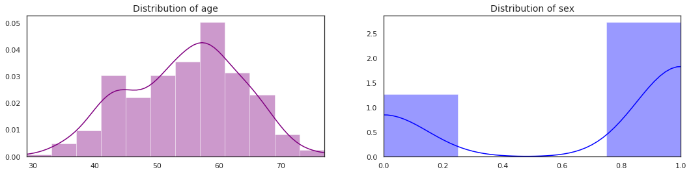


```python
fig, ax = plt.subplots(1, 2, figsize=(18,4))
cp = data['cp'].values
trestbps = data['trestbps'].values
sns.distplot(cp, ax=ax[0], color='green')
ax[0].set_title('Distribution of chest pain', fontsize=14)
ax[0].set_xlim([min(cp), max(cp)])
sns.distplot(trestbps, ax=ax[1], color='orange')
ax[1].set_title('Distribution of trestbps', fontsize=14)
ax[1].set_xlim([min(trestbps), max(trestbps)])
plt.show()

```


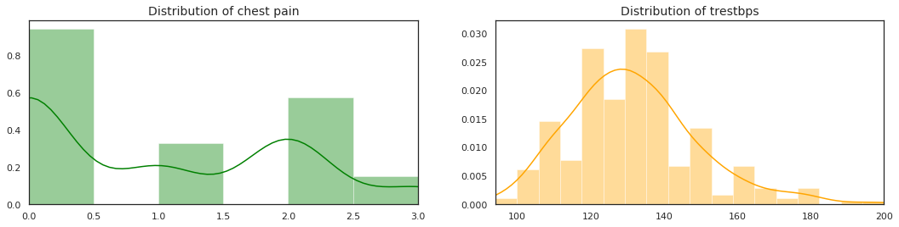


```python
fig, ax = plt.subplots(1, 2, figsize=(18,4))
chol = data['chol'].values
fbs = data['fbs'].values
sns.distplot(chol, ax=ax[0], color='brown')
ax[0].set_title('Distribution of cholestrol', fontsize=14)
ax[0].set_xlim([min(chol), max(chol)])
sns.distplot(fbs, ax=ax[1], color='blue')
ax[1].set_title('Distribution of fasting blood sugar', fontsize=14)
ax[1].set_xlim([min(fbs), max(fbs)])
plt.show()

```


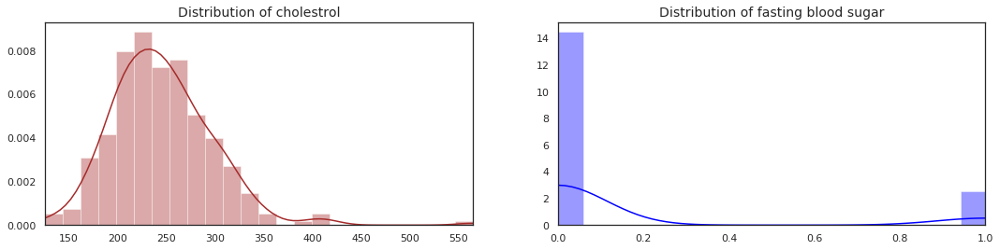


```python
fig, ax = plt.subplots(1, 2, figsize=(18,4))
restecg = data['restecg'].values
thalach = data['thalach'].values
sns.distplot(restecg,ax=ax[0], color='r')
ax[0].set_title('Distribution of ecg resting electrode', fontsize=14)
ax[0].set_xlim([min(restecg), max(restecg)])
sns.distplot(thalach, ax=ax[1], color='b')
ax[1].set_title('Distribution of thalach', fontsize=14)
ax[1].set_xlim([min(thalach), max(thalach)])
plt.show()

```


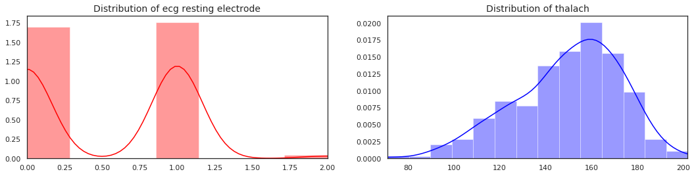


```python
fig, ax = plt.subplots(1, 2, figsize=(18,4))
exang = data['exang'].values
oldpeak = data['oldpeak'].values
sns.distplot(exang,ax=ax[0], color='yellow')
ax[0].set_title('Distribution of exang', fontsize=14)
ax[0].set_xlim([min(exang), max(exang)])
sns.distplot(oldpeak, ax=ax[1], color='b')
ax[1].set_title('Distribution of oldpeak', fontsize=14)
ax[1].set_xlim([min(oldpeak), max(oldpeak)])
plt.show()

```


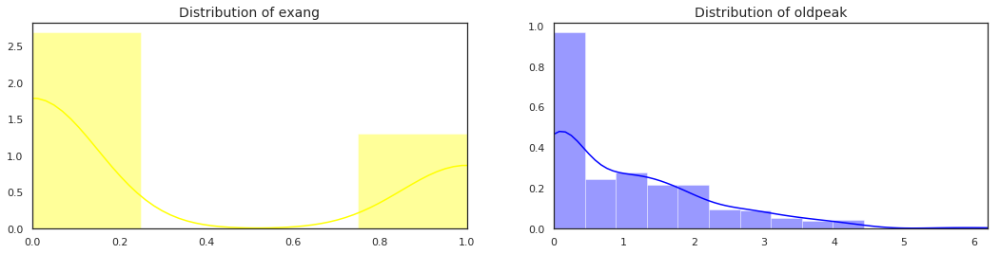


```python
fig, ax = plt.subplots(1, 2, figsize=(18,4))
slope = data['slope'].values
ca = data['ca'].values
sns.distplot(slope,ax=ax[0], color='red')
ax[0].set_title('Distribution of slope', fontsize=14)
ax[0].set_xlim([min(slope), max(slope)])
sns.distplot(ca, ax=ax[1], color='green')
ax[1].set_title('Distribution of ca', fontsize=14)
ax[1].set_xlim([min(ca), max(ca)])
plt.show()

```


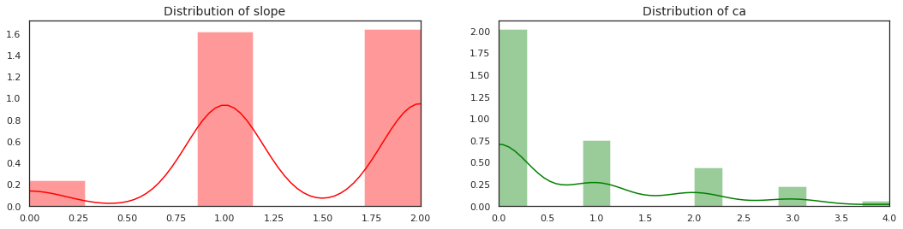


```python
fig, ax = plt.subplots(1, 2, figsize=(18,4))
thal = data['thal'].values
target = data['target'].values
sns.distplot(thal,ax=ax[0], color='blue')
ax[0].set_title('Distribution of thal', fontsize=14)
ax[0].set_xlim([min(thal), max(thal)])
sns.distplot(target, ax=ax[1], color='green')
ax[1].set_title('Distribution of target', fontsize=14)
ax[1].set_xlim([min(target), max(target)])
plt.show()

```


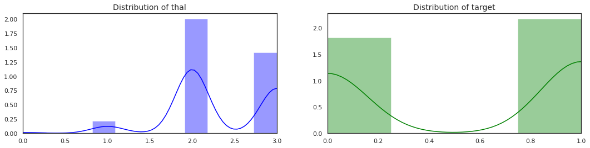


<h1> Getting Insight <h1>


```python
data.describe()
```


<div>
<style scoped>
    .dataframe tbody tr th:only-of-type {
        vertical-align: middle;
    }

    .dataframe tbody tr th {
        vertical-align: top;
    }
    
    .dataframe thead th {
        text-align: right;
    }
</style>
<table border="1" class="dataframe">
  <thead>
    <tr style="text-align: right;">
      <th></th>
      <th>age</th>
      <th>sex</th>
      <th>cp</th>
      <th>trestbps</th>
      <th>chol</th>
      <th>fbs</th>
      <th>restecg</th>
      <th>thalach</th>
      <th>exang</th>
      <th>oldpeak</th>
      <th>slope</th>
      <th>ca</th>
      <th>thal</th>
      <th>target</th>
    </tr>
  </thead>
  <tbody>
    <tr>
      <th>count</th>
      <td>303.000000</td>
      <td>303.000000</td>
      <td>303.000000</td>
      <td>303.000000</td>
      <td>303.000000</td>
      <td>303.000000</td>
      <td>303.000000</td>
      <td>303.000000</td>
      <td>303.000000</td>
      <td>303.000000</td>
      <td>303.000000</td>
      <td>303.000000</td>
      <td>303.000000</td>
      <td>303.000000</td>
    </tr>
    <tr>
      <th>mean</th>
      <td>54.366337</td>
      <td>0.683168</td>
      <td>0.966997</td>
      <td>131.623762</td>
      <td>246.264026</td>
      <td>0.148515</td>
      <td>0.528053</td>
      <td>149.646865</td>
      <td>0.326733</td>
      <td>1.039604</td>
      <td>1.399340</td>
      <td>0.729373</td>
      <td>2.313531</td>
      <td>0.544554</td>
    </tr>
    <tr>
      <th>std</th>
      <td>9.082101</td>
      <td>0.466011</td>
      <td>1.032052</td>
      <td>17.538143</td>
      <td>51.830751</td>
      <td>0.356198</td>
      <td>0.525860</td>
      <td>22.905161</td>
      <td>0.469794</td>
      <td>1.161075</td>
      <td>0.616226</td>
      <td>1.022606</td>
      <td>0.612277</td>
      <td>0.498835</td>
    </tr>
    <tr>
      <th>min</th>
      <td>29.000000</td>
      <td>0.000000</td>
      <td>0.000000</td>
      <td>94.000000</td>
      <td>126.000000</td>
      <td>0.000000</td>
      <td>0.000000</td>
      <td>71.000000</td>
      <td>0.000000</td>
      <td>0.000000</td>
      <td>0.000000</td>
      <td>0.000000</td>
      <td>0.000000</td>
      <td>0.000000</td>
    </tr>
    <tr>
      <th>25%</th>
      <td>47.500000</td>
      <td>0.000000</td>
      <td>0.000000</td>
      <td>120.000000</td>
      <td>211.000000</td>
      <td>0.000000</td>
      <td>0.000000</td>
      <td>133.500000</td>
      <td>0.000000</td>
      <td>0.000000</td>
      <td>1.000000</td>
      <td>0.000000</td>
      <td>2.000000</td>
      <td>0.000000</td>
    </tr>
    <tr>
      <th>50%</th>
      <td>55.000000</td>
      <td>1.000000</td>
      <td>1.000000</td>
      <td>130.000000</td>
      <td>240.000000</td>
      <td>0.000000</td>
      <td>1.000000</td>
      <td>153.000000</td>
      <td>0.000000</td>
      <td>0.800000</td>
      <td>1.000000</td>
      <td>0.000000</td>
      <td>2.000000</td>
      <td>1.000000</td>
    </tr>
    <tr>
      <th>75%</th>
      <td>61.000000</td>
      <td>1.000000</td>
      <td>2.000000</td>
      <td>140.000000</td>
      <td>274.500000</td>
      <td>0.000000</td>
      <td>1.000000</td>
      <td>166.000000</td>
      <td>1.000000</td>
      <td>1.600000</td>
      <td>2.000000</td>
      <td>1.000000</td>
      <td>3.000000</td>
      <td>1.000000</td>
    </tr>
    <tr>
      <th>max</th>
      <td>77.000000</td>
      <td>1.000000</td>
      <td>3.000000</td>
      <td>200.000000</td>
      <td>564.000000</td>
      <td>1.000000</td>
      <td>2.000000</td>
      <td>202.000000</td>
      <td>1.000000</td>
      <td>6.200000</td>
      <td>2.000000</td>
      <td>4.000000</td>
      <td>3.000000</td>
      <td>1.000000</td>
    </tr>
  </tbody>
</table>
</div>


**Checking for null values**


```python
data.isnull().any()
```


    age         False
    sex         False
    cp          False
    trestbps    False
    chol        False
    fbs         False
    restecg     False
    thalach     False
    exang       False
    oldpeak     False
    slope       False
    ca          False
    thal        False
    target      False
    dtype: bool


No null values

Counting the total target values in each class


```python
data.target.value_counts()
```


    1    165
    0    138
    Name: target, dtype: int64


Checking for the existence of any duplicate values.
The duplicates should be tackled down safely,otherwise would affect in generalization of the model.There might be a chance if duplicates are not dealt properly, they might show up in the test dataset which are also in the training dataset. 


```python
data[data.duplicated()==True]
```


<div>
<style scoped>
    .dataframe tbody tr th:only-of-type {
        vertical-align: middle;
    }

    .dataframe tbody tr th {
        vertical-align: top;
    }
    
    .dataframe thead th {
        text-align: right;
    }
</style>
<table border="1" class="dataframe">
  <thead>
    <tr style="text-align: right;">
      <th></th>
      <th>age</th>
      <th>sex</th>
      <th>cp</th>
      <th>trestbps</th>
      <th>chol</th>
      <th>fbs</th>
      <th>restecg</th>
      <th>thalach</th>
      <th>exang</th>
      <th>oldpeak</th>
      <th>slope</th>
      <th>ca</th>
      <th>thal</th>
      <th>target</th>
    </tr>
  </thead>
  <tbody>
    <tr>
      <th>164</th>
      <td>38</td>
      <td>1</td>
      <td>2</td>
      <td>138</td>
      <td>175</td>
      <td>0</td>
      <td>1</td>
      <td>173</td>
      <td>0</td>
      <td>0.0</td>
      <td>2</td>
      <td>4</td>
      <td>2</td>
      <td>1</td>
    </tr>
  </tbody>
</table>
</div>


```python
data.drop_duplicates(inplace=True)
data[data.duplicated()==True]
```


<div>
<style scoped>
    .dataframe tbody tr th:only-of-type {
        vertical-align: middle;
    }

    .dataframe tbody tr th {
        vertical-align: top;
    }
    
    .dataframe thead th {
        text-align: right;
    }
</style>
<table border="1" class="dataframe">
  <thead>
    <tr style="text-align: right;">
      <th></th>
      <th>age</th>
      <th>sex</th>
      <th>cp</th>
      <th>trestbps</th>
      <th>chol</th>
      <th>fbs</th>
      <th>restecg</th>
      <th>thalach</th>
      <th>exang</th>
      <th>oldpeak</th>
      <th>slope</th>
      <th>ca</th>
      <th>thal</th>
      <th>target</th>
    </tr>
  </thead>
  <tbody>
  </tbody>
</table>
</div>


<h1><b> Checking the gender distribution </b> </h1>

<li>0 resembles Female</li>
<li>1 resembles Male</li>


```python
male=data.sex.value_counts()[1]
female=data.sex.value_counts()[0]
print("Male   :",male)
print("Female :", female)
sns.countplot(x="sex",data=data,palette="bright")
plt.show()

fig = plt.Circle((0, 0), 0.7, color = 'white')
plt.rcParams['figure.figsize'] = (9, 9)
plt.pie(data.sex.value_counts(), colors = ["orange","blue"], labels = ["Male","Female"], shadow = True, explode = (0,0.1), autopct = '%.2f%%')
plt.title('Distribution of Gender', fontsize = 20)
p = plt.gcf()
p.gca().add_artist(fig)
plt.legend()
plt.show()

```

    Male   : 206
    Female : 96


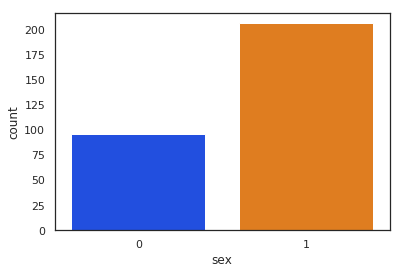


>Researchers found that throughout life, men were about twice as likely as women to have a heart attack. That higher risk persisted even after they accounted for traditional risk factors for heart disease, including high cholesterol, high blood pressure, diabetes, body mass index, and physical activity.
https://www.health.harvard.edu/heart-health/throughout-life-heart-attacks-are-twice-as-common-in-men-than-women

<h1> Age Distribution </h1>
<b> Which age is prone to get affected by heart disease <b>


```python
#What age people get heart disease
sns.distplot(data.age, hist = False, kde = True,
                 kde_kws = {'shade': True, 'linewidth': 3}, 
                  label = "age")
plt.plot()
```


    []


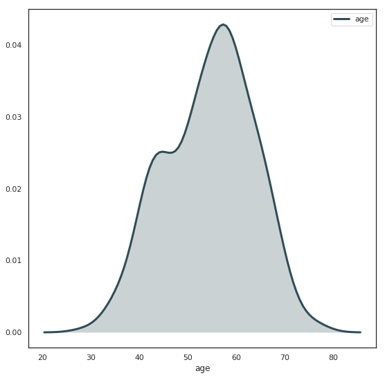


We see from the distribution that age between 50-60 is mostly likely to have the heart related disease and the average age to get affected is at age 55

<h1> Finding which attribute contributes to the heart disease </h1>


```python
data.head()
```


<div>
<style scoped>
    .dataframe tbody tr th:only-of-type {
        vertical-align: middle;
    }

    .dataframe tbody tr th {
        vertical-align: top;
    }
    
    .dataframe thead th {
        text-align: right;
    }
</style>
<table border="1" class="dataframe">
  <thead>
    <tr style="text-align: right;">
      <th></th>
      <th>age</th>
      <th>sex</th>
      <th>cp</th>
      <th>trestbps</th>
      <th>chol</th>
      <th>fbs</th>
      <th>restecg</th>
      <th>thalach</th>
      <th>exang</th>
      <th>oldpeak</th>
      <th>slope</th>
      <th>ca</th>
      <th>thal</th>
      <th>target</th>
    </tr>
  </thead>
  <tbody>
    <tr>
      <th>0</th>
      <td>63</td>
      <td>1</td>
      <td>3</td>
      <td>145</td>
      <td>233</td>
      <td>1</td>
      <td>0</td>
      <td>150</td>
      <td>0</td>
      <td>2.3</td>
      <td>0</td>
      <td>0</td>
      <td>1</td>
      <td>1</td>
    </tr>
    <tr>
      <th>1</th>
      <td>37</td>
      <td>1</td>
      <td>2</td>
      <td>130</td>
      <td>250</td>
      <td>0</td>
      <td>1</td>
      <td>187</td>
      <td>0</td>
      <td>3.5</td>
      <td>0</td>
      <td>0</td>
      <td>2</td>
      <td>1</td>
    </tr>
    <tr>
      <th>2</th>
      <td>41</td>
      <td>0</td>
      <td>1</td>
      <td>130</td>
      <td>204</td>
      <td>0</td>
      <td>0</td>
      <td>172</td>
      <td>0</td>
      <td>1.4</td>
      <td>2</td>
      <td>0</td>
      <td>2</td>
      <td>1</td>
    </tr>
    <tr>
      <th>3</th>
      <td>56</td>
      <td>1</td>
      <td>1</td>
      <td>120</td>
      <td>236</td>
      <td>0</td>
      <td>1</td>
      <td>178</td>
      <td>0</td>
      <td>0.8</td>
      <td>2</td>
      <td>0</td>
      <td>2</td>
      <td>1</td>
    </tr>
    <tr>
      <th>4</th>
      <td>57</td>
      <td>0</td>
      <td>0</td>
      <td>120</td>
      <td>354</td>
      <td>0</td>
      <td>1</td>
      <td>163</td>
      <td>1</td>
      <td>0.6</td>
      <td>2</td>
      <td>0</td>
      <td>2</td>
      <td>1</td>
    </tr>
  </tbody>
</table>
</div>


```python
plt.rcParams['figure.figsize'] = (12, 8)
sns.swarmplot(data['target'], data['age'], palette = 'Set2', size = 7)
plt.title('Age factor contributing to disease', fontsize = 14, fontweight = 25)
plt.show()
```


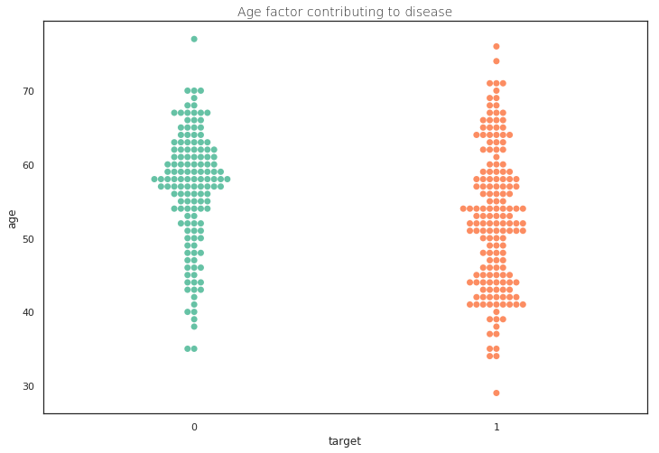


```python
ax=sns.kdeplot(data.chol, data.target,cmap="Greens", shade=True, shade_lowest=False)
```


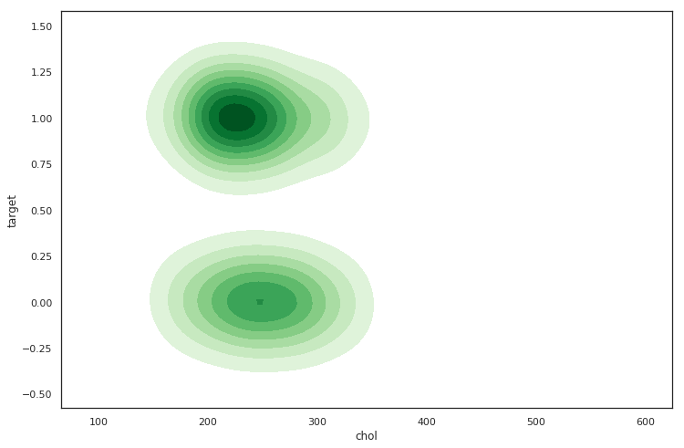


```python
#fbs
ax=sns.kdeplot(data.thalach, data.target,cmap="Reds", shade=True, shade_lowest=False)
```


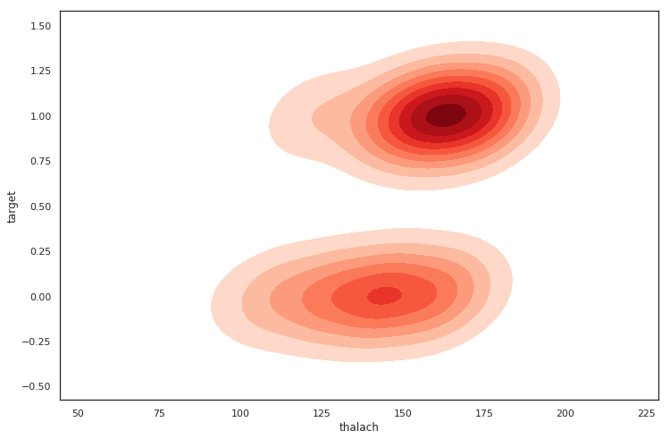


```python
sns.countplot(x="target",data=data,palette="pastel")
plt.show()
```


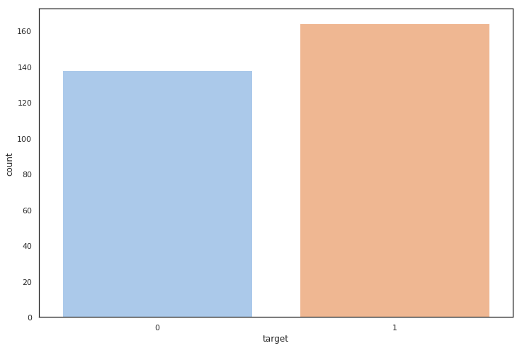


```python
X=data.iloc[:,:-1]
y=data.iloc[:,-1]
```


```python
from sklearn.model_selection import train_test_split
X_train,X_test,Y_train,Y_test=train_test_split(X,y,test_size=0.2,random_state=20)

```

**The Model**

Using Random Forest and then using GridSearch CV to find the best parameter


```python
from sklearn.ensemble import RandomForestClassifier
model = RandomForestClassifier(n_estimators=100,max_depth=5)
model.fit(X_train, Y_train)
```


    RandomForestClassifier(bootstrap=True, class_weight=None, criterion='gini',
                max_depth=5, max_features='auto', max_leaf_nodes=None,
                min_impurity_decrease=0.0, min_impurity_split=None,
                min_samples_leaf=1, min_samples_split=2,
                min_weight_fraction_leaf=0.0, n_estimators=100, n_jobs=None,
                oob_score=False, random_state=None, verbose=0,
                warm_start=False)


```python
Y_pred=model.predict(X_test)
accuracy=accuracy_score(Y_test,Y_pred)
accuracy
```


    0.8524590163934426


```python
from sklearn.model_selection import GridSearchCV
parameters = {'n_estimators':[1,500], 'max_depth':[1, 15]}
clf = GridSearchCV(model, parameters, cv=5)
clf.fit(X_train,Y_train)
print(clf.best_params_)
```

    {'n_estimators': 500, 'max_depth': 1}


Using the parameter achieved from the GridSearch to 


```python
model = RandomForestClassifier(n_estimators=500,max_depth=1)
model.fit(X_train, Y_train)
Y_pred=model.predict(X_test)
cm=confusion_matrix(Y_test.tolist(),Y_pred.tolist())
print("Accuracy:",accuracy_score(Y_test,Y_pred))
print("Precision Score :",precision_score(Y_test,Y_pred))
print("f1 Score :",f1_score(Y_test,Y_pred))
print("Confusion Matrix: \n",cm)

```

    Accuracy: 0.8852459016393442
    Precision Score : 0.9428571428571428
    f1 Score : 0.904109589041096
    Confusion Matrix: 
     [[21  2]
     [ 5 33]]


```python
total=sum(sum(cm))
sensitivity = cm[0,0]/(cm[0,0]+cm[1,0])
print('Sensitivity : ', sensitivity )
specificity = cm[1,1]/(cm[1,1]+cm[0,1])
print('Specificity : ', specificity)
```

    Sensitivity :  0.8076923076923077
    Specificity :  0.9428571428571428


```python
X_train.shape
```


    (241, 13)


```python
model=Sequential()
model.add(Dense(256, init="normal", input_dim=13, activation='relu'))
model.add(Dense(512, init ="normal", activation="relu"))
model.add(Dense(128, init ="normal", activation="relu"))
model.add(Dense(1, init="normal", activation="sigmoid"))
model.compile(loss="binary_crossentropy", metrics=['accuracy'], optimizer='adam')
model.summary()
history=model.fit(X_train,Y_train, epochs=100, batch_size=100)
```

    WARNING:tensorflow:From /usr/local/lib/python3.5/dist-packages/tensorflow/python/framework/op_def_library.py:263: colocate_with (from tensorflow.python.framework.ops) is deprecated and will be removed in a future version.
    Instructions for updating:
    Colocations handled automatically by placer.
    _________________________________________________________________
    Layer (type)                 Output Shape              Param #   
    =================================================================
    dense_1 (Dense)              (None, 256)               3584      
    _________________________________________________________________
    dense_2 (Dense)              (None, 512)               131584    
    _________________________________________________________________
    dense_3 (Dense)              (None, 128)               65664     
    _________________________________________________________________
    dense_4 (Dense)              (None, 1)                 129       
    =================================================================
    Total params: 200,961
    Trainable params: 200,961
    Non-trainable params: 0
    _________________________________________________________________
    WARNING:tensorflow:From /usr/local/lib/python3.5/dist-packages/tensorflow/python/ops/math_ops.py:3066: to_int32 (from tensorflow.python.ops.math_ops) is deprecated and will be removed in a future version.
    Instructions for updating:
    Use tf.cast instead.
    Epoch 1/100
    241/241 [==============================] - 0s 2ms/step - loss: 1.8144 - acc: 0.5685
    Epoch 2/100
    241/241 [==============================] - 0s 138us/step - loss: 0.9965 - acc: 0.5228
    Epoch 3/100
    241/241 [==============================] - 0s 166us/step - loss: 1.0311 - acc: 0.5021
    Epoch 4/100
    241/241 [==============================] - 0s 145us/step - loss: 0.7395 - acc: 0.5477
    Epoch 5/100
    241/241 [==============================] - 0s 160us/step - loss: 0.6407 - acc: 0.6515
    Epoch 6/100
    241/241 [==============================] - 0s 157us/step - loss: 0.6210 - acc: 0.6680
    Epoch 7/100
    241/241 [==============================] - 0s 198us/step - loss: 0.6322 - acc: 0.6307
    Epoch 8/100
    241/241 [==============================] - 0s 140us/step - loss: 0.6431 - acc: 0.6763
    Epoch 9/100
    241/241 [==============================] - 0s 149us/step - loss: 0.5863 - acc: 0.7054
    Epoch 10/100
    241/241 [==============================] - 0s 187us/step - loss: 0.5768 - acc: 0.7137
    Epoch 11/100
    241/241 [==============================] - 0s 133us/step - loss: 0.5749 - acc: 0.6805
    Epoch 12/100
    241/241 [==============================] - 0s 148us/step - loss: 0.5745 - acc: 0.7095
    Epoch 13/100
    241/241 [==============================] - 0s 146us/step - loss: 0.5956 - acc: 0.6722
    Epoch 14/100
    241/241 [==============================] - 0s 134us/step - loss: 0.5903 - acc: 0.6846
    Epoch 15/100
    241/241 [==============================] - 0s 153us/step - loss: 0.5731 - acc: 0.7095
    Epoch 16/100
    241/241 [==============================] - 0s 152us/step - loss: 0.5593 - acc: 0.7137
    Epoch 17/100
    241/241 [==============================] - 0s 124us/step - loss: 0.5897 - acc: 0.6846
    Epoch 18/100
    241/241 [==============================] - 0s 131us/step - loss: 0.5715 - acc: 0.7012
    Epoch 19/100
    241/241 [==============================] - 0s 159us/step - loss: 0.5682 - acc: 0.6971
    Epoch 20/100
    241/241 [==============================] - 0s 147us/step - loss: 0.5781 - acc: 0.7054
    Epoch 21/100
    241/241 [==============================] - 0s 157us/step - loss: 0.5471 - acc: 0.6805
    Epoch 22/100
    241/241 [==============================] - 0s 161us/step - loss: 0.5627 - acc: 0.7178
    Epoch 23/100
    241/241 [==============================] - 0s 153us/step - loss: 0.5625 - acc: 0.7054
    Epoch 24/100
    241/241 [==============================] - 0s 151us/step - loss: 0.5459 - acc: 0.7261
    Epoch 25/100
    241/241 [==============================] - 0s 147us/step - loss: 0.5414 - acc: 0.7344
    Epoch 26/100
    241/241 [==============================] - 0s 142us/step - loss: 0.5478 - acc: 0.7137
    Epoch 27/100
    241/241 [==============================] - 0s 133us/step - loss: 0.5367 - acc: 0.7261
    Epoch 28/100
    241/241 [==============================] - 0s 153us/step - loss: 0.5348 - acc: 0.7178
    Epoch 29/100
    241/241 [==============================] - 0s 152us/step - loss: 0.5295 - acc: 0.7303
    Epoch 30/100
    241/241 [==============================] - 0s 179us/step - loss: 0.5243 - acc: 0.7220
    Epoch 31/100
    241/241 [==============================] - 0s 161us/step - loss: 0.5264 - acc: 0.7220
    Epoch 32/100
    241/241 [==============================] - 0s 146us/step - loss: 0.5275 - acc: 0.7303
    Epoch 33/100
    241/241 [==============================] - 0s 171us/step - loss: 0.5515 - acc: 0.7220
    Epoch 34/100
    241/241 [==============================] - 0s 132us/step - loss: 0.5427 - acc: 0.7012
    Epoch 35/100
    241/241 [==============================] - 0s 155us/step - loss: 0.5652 - acc: 0.7220
    Epoch 36/100
    241/241 [==============================] - 0s 182us/step - loss: 0.5548 - acc: 0.7261
    Epoch 37/100
    241/241 [==============================] - 0s 151us/step - loss: 0.5159 - acc: 0.7344
    Epoch 38/100
    241/241 [==============================] - 0s 162us/step - loss: 0.5165 - acc: 0.7386
    Epoch 39/100
    241/241 [==============================] - 0s 145us/step - loss: 0.4940 - acc: 0.7552
    Epoch 40/100
    241/241 [==============================] - 0s 156us/step - loss: 0.4939 - acc: 0.7469
    Epoch 41/100
    241/241 [==============================] - 0s 137us/step - loss: 0.4879 - acc: 0.7552
    Epoch 42/100
    241/241 [==============================] - 0s 116us/step - loss: 0.4999 - acc: 0.7303
    Epoch 43/100
    241/241 [==============================] - 0s 117us/step - loss: 0.4929 - acc: 0.7759
    Epoch 44/100
    241/241 [==============================] - 0s 121us/step - loss: 0.4699 - acc: 0.7635
    Epoch 45/100
    241/241 [==============================] - 0s 139us/step - loss: 0.4674 - acc: 0.7884
    Epoch 46/100
    241/241 [==============================] - 0s 136us/step - loss: 0.4812 - acc: 0.7427
    Epoch 47/100
    241/241 [==============================] - 0s 141us/step - loss: 0.4969 - acc: 0.7676
    Epoch 48/100
    241/241 [==============================] - 0s 134us/step - loss: 0.6732 - acc: 0.6888
    Epoch 49/100
    241/241 [==============================] - 0s 141us/step - loss: 0.5792 - acc: 0.7220
    Epoch 50/100
    241/241 [==============================] - 0s 114us/step - loss: 0.5722 - acc: 0.7676
    Epoch 51/100
    241/241 [==============================] - 0s 119us/step - loss: 0.5516 - acc: 0.7261
    Epoch 52/100
    241/241 [==============================] - 0s 142us/step - loss: 0.5045 - acc: 0.7552
    Epoch 53/100
    241/241 [==============================] - 0s 155us/step - loss: 0.4750 - acc: 0.7510
    Epoch 54/100
    241/241 [==============================] - 0s 132us/step - loss: 0.4587 - acc: 0.7967
    Epoch 55/100
    241/241 [==============================] - 0s 130us/step - loss: 0.4597 - acc: 0.7676
    Epoch 56/100
    241/241 [==============================] - 0s 149us/step - loss: 0.4674 - acc: 0.7635
    Epoch 57/100
    241/241 [==============================] - 0s 142us/step - loss: 0.4286 - acc: 0.8050
    Epoch 58/100
    241/241 [==============================] - 0s 125us/step - loss: 0.4298 - acc: 0.8050
    Epoch 59/100
    241/241 [==============================] - 0s 155us/step - loss: 0.4272 - acc: 0.8091
    Epoch 60/100
    241/241 [==============================] - 0s 138us/step - loss: 0.4119 - acc: 0.8133
    Epoch 61/100
    241/241 [==============================] - 0s 142us/step - loss: 0.4083 - acc: 0.8174
    Epoch 62/100
    241/241 [==============================] - 0s 133us/step - loss: 0.4024 - acc: 0.8216
    Epoch 63/100
    241/241 [==============================] - 0s 148us/step - loss: 0.4018 - acc: 0.8216
    Epoch 64/100
    241/241 [==============================] - 0s 134us/step - loss: 0.4204 - acc: 0.8050
    Epoch 65/100
    241/241 [==============================] - 0s 147us/step - loss: 0.4194 - acc: 0.8174
    Epoch 66/100
    241/241 [==============================] - 0s 140us/step - loss: 0.4475 - acc: 0.7759
    Epoch 67/100
    241/241 [==============================] - 0s 148us/step - loss: 0.4273 - acc: 0.7842
    Epoch 68/100
    241/241 [==============================] - 0s 121us/step - loss: 0.4138 - acc: 0.8133
    Epoch 69/100
    241/241 [==============================] - 0s 136us/step - loss: 0.4110 - acc: 0.8174
    Epoch 70/100
    241/241 [==============================] - 0s 144us/step - loss: 0.3992 - acc: 0.8216
    Epoch 71/100
    241/241 [==============================] - 0s 135us/step - loss: 0.3783 - acc: 0.8340
    Epoch 72/100
    241/241 [==============================] - 0s 147us/step - loss: 0.4366 - acc: 0.7884
    Epoch 73/100
    241/241 [==============================] - 0s 144us/step - loss: 0.4353 - acc: 0.8133
    Epoch 74/100
    241/241 [==============================] - 0s 139us/step - loss: 0.4213 - acc: 0.8091
    Epoch 75/100
    241/241 [==============================] - 0s 143us/step - loss: 0.4155 - acc: 0.8133
    Epoch 76/100
    241/241 [==============================] - 0s 122us/step - loss: 0.4122 - acc: 0.8091
    Epoch 77/100
    241/241 [==============================] - 0s 133us/step - loss: 0.3829 - acc: 0.8299
    Epoch 78/100
    241/241 [==============================] - 0s 134us/step - loss: 0.4051 - acc: 0.8008
    Epoch 79/100
    241/241 [==============================] - 0s 131us/step - loss: 0.4246 - acc: 0.7925
    Epoch 80/100
    241/241 [==============================] - 0s 136us/step - loss: 0.4146 - acc: 0.8133
    Epoch 81/100
    241/241 [==============================] - 0s 130us/step - loss: 0.3726 - acc: 0.8257
    Epoch 82/100
    241/241 [==============================] - 0s 130us/step - loss: 0.3713 - acc: 0.8465
    Epoch 83/100
    241/241 [==============================] - 0s 135us/step - loss: 0.3772 - acc: 0.8340
    Epoch 84/100
    241/241 [==============================] - 0s 146us/step - loss: 0.3819 - acc: 0.8340
    Epoch 85/100
    241/241 [==============================] - 0s 149us/step - loss: 0.3644 - acc: 0.8299
    Epoch 86/100
    241/241 [==============================] - 0s 137us/step - loss: 0.3604 - acc: 0.8382
    Epoch 87/100
    241/241 [==============================] - 0s 139us/step - loss: 0.3540 - acc: 0.8548
    Epoch 88/100
    241/241 [==============================] - 0s 145us/step - loss: 0.3506 - acc: 0.8465
    Epoch 89/100
    241/241 [==============================] - 0s 137us/step - loss: 0.3843 - acc: 0.8340
    Epoch 90/100
    241/241 [==============================] - 0s 134us/step - loss: 0.4011 - acc: 0.8299
    Epoch 91/100
    241/241 [==============================] - 0s 138us/step - loss: 0.4295 - acc: 0.8216
    Epoch 92/100
    241/241 [==============================] - 0s 138us/step - loss: 0.4182 - acc: 0.8008
    Epoch 93/100
    241/241 [==============================] - 0s 164us/step - loss: 0.3872 - acc: 0.8174
    Epoch 94/100
    241/241 [==============================] - 0s 142us/step - loss: 0.4455 - acc: 0.8050
    Epoch 95/100
    241/241 [==============================] - 0s 133us/step - loss: 0.4144 - acc: 0.8174
    Epoch 96/100
    241/241 [==============================] - 0s 153us/step - loss: 0.3690 - acc: 0.8382
    Epoch 97/100
    241/241 [==============================] - 0s 135us/step - loss: 0.3765 - acc: 0.8216
    Epoch 98/100
    241/241 [==============================] - 0s 142us/step - loss: 0.3474 - acc: 0.8382
    Epoch 99/100
    241/241 [==============================] - 0s 147us/step - loss: 0.3500 - acc: 0.8423
    Epoch 100/100
    241/241 [==============================] - 0s 134us/step - loss: 0.3561 - acc: 0.8382


```python
plt.plot(history.history['loss'])
#plt.plot(history.history['val_loss'])
plt.title('model loss')
plt.ylabel('loss')
plt.xlabel('epoch')
plt.legend(['train', 'test'], loc='upper left')
plt.show()

```


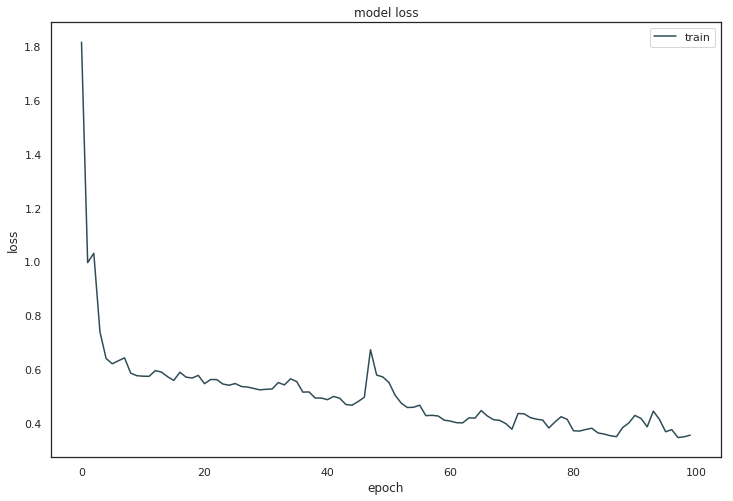


```python

```
